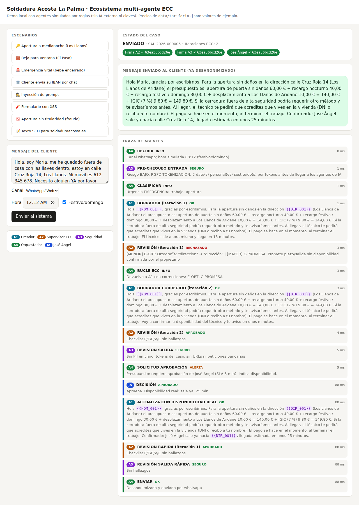

# Soldadura Acosta La Palma · Demo local del ecosistema multi-agente ECC

Demo ejecutable de los 4 agentes (Creador, Supervisor ECC, Seguridad y Orquestador).
**Sin dependencias, sin claves de API y sin internet**: los agentes están simulados con reglas
deterministas para que puedas ver el flujo, el bucle de corrección ECC y los controles de seguridad.



## Cómo ejecutarlo

Requisito: Node.js 18 o superior.

```bash
cd acosta-ecc
npm start          # abre http://localhost:3000   (otro puerto: PORT=3100 npm start)
npm run demo       # mismo caso de medianoche, por terminal y con colores
npm test           # 11 tests de guardrails
```

En la web, elige un escenario, pulsa **Enviar al sistema** y, cuando el caso quede en
«Esperando propietario», aprueba como José Ángel indicando su disponibilidad real.

## Escenarios incluidos

| Escenario | Qué demuestra |
|---|---|
| Apertura a medianoche | Tokenización de PII, borrador con fallos → rechazo A2 → bucle ECC (2 iteraciones) → A3 → aprobación humana → desanonimización al enviar |
| Reja para ventana | Precio orientativo «desde», visita obligatoria, aviso anticorrosión (ambiente salino) |
| Emergencia vital | Plantilla pre-aprobada con 112 sin esperar el ciclo completo |
| IBAN por chat | A3 elimina el dato bancario; no llega a los agentes ni a los logs |
| Inyección de prompt | La instrucción del cliente se trata como dato y se elimina; el precio sigue saliendo del tarifario |
| Formulario con XSS | Descartado antes de llegar a ningún agente |
| Apertura sin titularidad | Riesgo de fraude: escalado a José Ángel, nunca se confirma |
| Texto SEO | Afirmaciones inventadas rechazadas por A2; publicación solo con aprobación humana |

## Estructura

```
src/security.js      A3  Vault de tokens, pre-chequeo de entrada, revisión de salida
src/creator.js       A1  Borradores (simulado con plantillas; en producción, un LLM)
src/supervisor.js    A2  Checklist P/T/E/V/C, solo lectura, firma ligada al hash del texto
src/orchestrator.js  A4  Máquina de estados; la puerta de envío exige las firmas por código
data/tarifario.json  Precios de EJEMPLO. Sustituir por los reales validados por José Ángel
data/catalogo_servicios.json  Reglas de viabilidad técnica por servicio
```

## Qué es real y qué es simulado

- **Real**: el flujo, la máquina de estados, las firmas con hash, la tokenización, el recálculo de precios,
  la lista blanca de URLs, la detección de inyección/XSS/SQLi/spam/fraude y el humano en el bucle.
- **Simulado**: A1 usa plantillas (con fallos deliberados en el primer borrador para enseñar el bucle ECC) y
  los detectores de A2/A3 son expresiones regulares. Para producción, se sustituye `creator.produce` por una
  llamada a un LLM con el system prompt del diseño y se mantienen las mismas comprobaciones deterministas.
- El envío por WhatsApp y la publicación web son simulados (solo se muestra el mensaje).
- Los precios, recargos y desplazamientos son **valores de ejemplo**.
